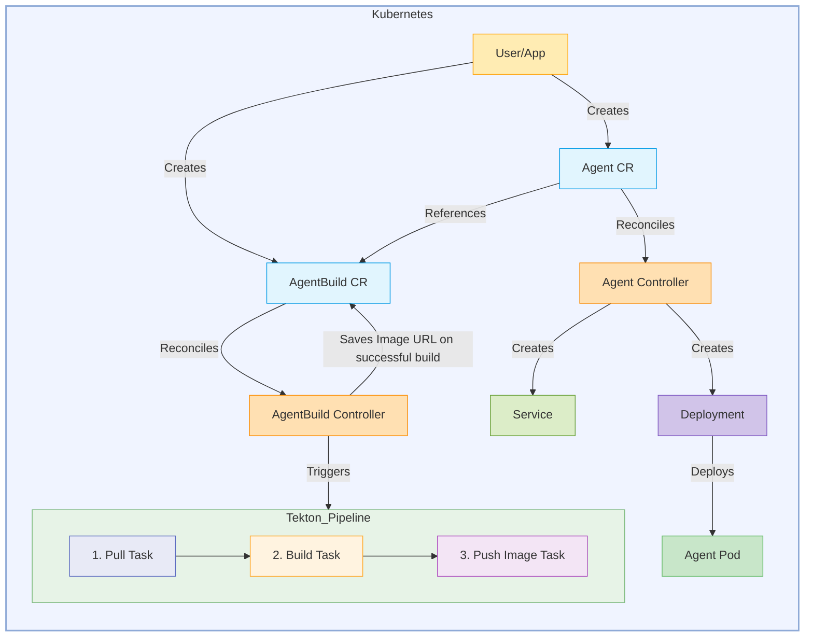

# Kagenti Operator

[](LICENSE)


**Kagenti Operator** is a Kubernetes operator that automates the complete lifecycle management of AI agents, from building container images from source code to deploying and managing them in Kubernetes clusters.

## Overview

The Kagenti Operator simplifies AI agent deployment by managing three Custom Resource Definitions (CRDs):

| Resource | Purpose |
|----------|---------|
| **[Agent](./docs/api-reference.md#agent)** | Deploys and manages AI agent workloads from container images or source code |
| **[AgentBuild](./docs/api-reference.md#agentbuild)** | Builds container images from GitHub repositories using Tekton pipelines |
| **[AgentCard](./docs/api-reference.md#agentcard)** | Automatically discovers and indexes agent metadata for Kubernetes-native agent discovery |

### Key Features

- **Deploy from Image or Source** — Use pre-built container images or build directly from GitHub repositories
- **Automated Build Pipelines** — Integrated Tekton pipelines with support for Dockerfile and Cloud Native Buildpacks
- **Dynamic Agent Discovery** — Kubernetes-native agent discovery through automatic indexing of agent metadata
- **Flexible Configuration** — Complete control over pod specifications, service ports, and environment variables
- **Security Built-in** — Support for private registries, secret management, and RBAC
- **Multi-Framework Support** — Works with LangGraph, CrewAI, AG2, and any A2A-compatible framework

## Architecture



The operator separates build and deployment concerns:
- **Agent CR** manages deployment lifecycle and runtime configuration
- **AgentBuild CR** orchestrates the build process using Tekton pipelines

## Quick Start

### Prerequisites

- Kubernetes cluster (v1.28+)
- kubectl configured to access your cluster
- [cert-manager](https://cert-manager.io/) installed (for webhook certificates)
- Tekton Pipelines installed (for building from source)
- Container registry access (for building from source)

### Install cert-manager

If cert-manager is not already installed in your cluster:

```bash
kubectl apply -f https://github.com/cert-manager/cert-manager/releases/download/v1.14.4/cert-manager.yaml

# Wait for cert-manager to be ready
kubectl wait --for=condition=Available deployment/cert-manager -n cert-manager --timeout=120s
kubectl wait --for=condition=Available deployment/cert-manager-webhook -n cert-manager --timeout=120s
```

### Install the Operator

Using Helm:

```bash
# Install the operator using OCI chart
helm install kagenti-operator \
  oci://ghcr.io/kagenti/kagenti-operator/kagenti-operator-chart \
  --version 0.2.0-alpha.19 \
  --namespace kagenti-system \
  --create-namespace
```

### Minimal Working Example

This example deploys a weather agent that you can interact with. It requires [Ollama](https://ollama.ai/) running locally as the LLM backend.

#### Step 1: Install and Start Ollama

```bash
# Install Ollama (macOS/Linux)
curl -fsSL https://ollama.ai/install.sh | sh

# Pull and run the required model
ollama pull llama3.2:3b-instruct-fp16
ollama serve  # Keep running in background
```

> **Note**: For Docker Desktop on macOS/Windows, `host.docker.internal` resolves to the host machine. For other Kubernetes setups (kind, minikube), you may need to adjust `LLM_API_BASE` to point to your Ollama instance.

#### Step 2: Deploy the Weather Agent

```bash
# Create namespace
kubectl create namespace kagenti

# Deploy the agent
kubectl apply -f - <<EOF
apiVersion: agent.kagenti.dev/v1alpha1
kind: Agent
metadata:
  name: weather-agent
  namespace: kagenti
  labels:
    app.kubernetes.io/name: weather-agent
spec:
  imageSource:
    image: "ghcr.io/kagenti/agent-examples/weather_service:v0.0.1-alpha.3"
  servicePorts:
    - port: 8000
      targetPort: 8000
      protocol: TCP
      name: http
  podTemplateSpec:
    spec:
      containers:
      - name: agent
        ports:
        - containerPort: 8000
        env:
        - name: PORT
          value: "8000"
        - name: LLM_API_BASE
          value: "http://host.docker.internal:11434/v1"
        - name: LLM_API_KEY
          value: "dummy"
        - name: LLM_MODEL
          value: "llama3.2:3b-instruct-fp16"
EOF
```

#### Step 3: Verify and Test

```bash
# Check agent is running
kubectl get agents -n kagenti
kubectl get pods -n kagenti

# View logs
kubectl logs -l app.kubernetes.io/name=weather-agent -n kagenti

# Test the agent endpoint (from within the cluster)
kubectl run curl-test -n kagenti --rm -i --restart=Never --image=curlimages/curl:8.1.2 -- \
  curl -s http://weather-agent.kagenti.svc.cluster.local:8000/.well-known/agent.json
```

#### Step 4: Add MCP Tools (Optional)

For full weather query capabilities, install the [ToolHive Operator](https://github.com/stacklok/toolhive) and deploy an MCP server:

```bash
# Install ToolHive Operator
helm upgrade -i toolhive-operator-crds oci://ghcr.io/stacklok/toolhive/toolhive-operator-crds
helm upgrade -i toolhive-operator oci://ghcr.io/stacklok/toolhive/toolhive-operator \
  -n toolhive-system --create-namespace

# Wait for operator to be ready
kubectl wait --for=condition=Available deployment/toolhive-operator -n toolhive-system --timeout=120s

# Create service account for the MCP server
kubectl create serviceaccount weather-tool -n kagenti

# Deploy the weather MCP server
kubectl apply -f - <<EOF
apiVersion: toolhive.stacklok.dev/v1alpha1
kind: MCPServer
metadata:
  name: weather-tool
  namespace: kagenti
  labels:
    toolhive-basename: weather-tool
spec:
  image: "ghcr.io/kagenti/agent-examples/weather_tool:v0.0.1-alpha.3"
  transport: streamable-http
  port: 8000
  targetPort: 8000
  proxyPort: 8000
  podTemplateSpec:
    spec:
      serviceAccountName: weather-tool
      containers:
        - name: mcp
          env:
            - name: PORT
              value: "8000"
EOF

# Update agent to use the MCP server
kubectl patch agent weather-agent -n kagenti --type='json' -p='[
  {"op": "add", "path": "/spec/podTemplateSpec/spec/containers/0/env/-",
   "value": {"name": "MCP_URL", "value": "http://mcp-weather-tool-proxy.kagenti.svc.cluster.local:8000/mcp"}}
]'
```

See [GETTING_STARTED.md](./GETTING_STARTED.md) for the complete setup including MCP integration.

---

### Deploy Your First Agent (Simple Examples)

**Option 1: From an existing container image**

```bash
kubectl apply -f - <<EOF
apiVersion: agent.kagenti.dev/v1alpha1
kind: Agent
metadata:
  name: my-agent
  namespace: default
spec:
  imageSource:
    image: "ghcr.io/kagenti/agent-examples/weather_service:v0.0.1-alpha.3"
  servicePorts:
    - port: 8000
      targetPort: 8000
      protocol: TCP
      name: http
  podTemplateSpec:
    spec:
      containers:
      - name: agent
        ports:
        - containerPort: 8000
        env:
        - name: PORT
          value: "8000"
EOF
```

**Option 2: Build from source code**

```bash
# First, create a build
kubectl apply -f - <<EOF
apiVersion: agent.kagenti.dev/v1alpha1
kind: AgentBuild
metadata:
  name: my-agent-build
  namespace: default
spec:
  mode: dev
  source:
    sourceRepository: "github.com/myorg/my-agent.git"
    sourceRevision: "main"
    sourceCredentials:
      name: github-token-secret
  buildOutput:
    image: "my-agent"
    imageTag: "v1.0.0"
    imageRegistry: "ghcr.io/myorg"
    imageRepoCredentials:
      name: ghcr-secret
EOF

# Then, deploy using the build
kubectl apply -f - <<EOF
apiVersion: agent.kagenti.dev/v1alpha1
kind: Agent
metadata:
  name: my-agent
  namespace: default
spec:
  imageSource:
    buildRef:
      name: my-agent-build
  servicePorts:
    - port: 8000
      targetPort: 8000
      protocol: TCP
      name: http
  podTemplateSpec:
    spec:
      containers:
      - name: agent
        ports:
        - containerPort: 8000
EOF
```

### Verify Deployment

```bash
# Check agent status
kubectl get agents

# Check agent build status
kubectl get agentbuilds

# View agent logs
kubectl logs -l app.kubernetes.io/name=my-agent
```

## Documentation

| Topic | Link |
|-------|------|
| **API Reference** | [CRD Specifications & Examples](./docs/api-reference.md) |
| **Architecture** | [Operator Design & Components](./docs/architecture.md) |
| **Dynamic Discovery** | [Agent Discovery with AgentCard](./docs/dynamic-agent-discovery.md) |
| **Developer Guide** | [Contributing & Development](./docs/dev.md) |
| **Getting Started** | [Detailed Tutorials](./GETTING_STARTED.md) |

## Examples

See the [config/samples](./config/samples) directory for complete examples:

- [weather-agent-minimal.yaml](./config/samples/weather-agent-minimal.yaml) — **Minimal standalone example** (requires only Ollama)
- [weather-agent-image-deployment.yaml](./config/samples/weather-agent-image-deployment.yaml) — Deploy from existing image (full configuration)
- [weather-agent-build-and-deploy.yaml](./config/samples/weather-agent-build-and-deploy.yaml) — Build and deploy from source
- [helloworld-build-and-deploy-no-dockerfile.yaml](./config/samples/helloworld-build-and-deploy-no-dockerfile.yaml) — Use Cloud Native Buildpacks

## Contributing

We welcome contributions! See [CONTRIBUTING.md](../CONTRIBUTING.md) for guidelines on:

- Reporting issues
- Submitting pull requests
- Development setup
- Testing requirements

## License

[Apache 2.0](LICENSE)
